# Selenium

## Was ist Selenium

Selenium ist ein automatisiertes Testframework für Webseiten, dass
normale Webbrowser für die Seitenaufrufe nutzt. Es kann jedoch auch sehr
gut genutzt werden um Webseiten aufzurufen und Daten von ihnen
abzurufen. Das ist sehr vorteilhaft, da viele Webseiten heute auf
Javascript aufbauen und komplexe DOMs aufweisen, wodurch ein manuelles
Parsing häufig nicht ausreicht oder sehr kompliziert ist.

## Selenium in Python

Um Selenium in Python einzubinden wird ein Binding angeboten, welches
mindestens Python 3.7 voraussetzt und mit `pip install selenium`
installiert werden kann.

# WebDriver

## Was sind WebDriver

WebDriver sind die Schnittstelle zwischen Selenium und dem eigentlichen
Webbrowser. Sie werden von den Browserentwicklern bereitgestellt und
müssen dementsprechend installiert werden, damit Selenium funktionieren
kann.

## WebDriver Downloads

Die Treiber für die beliebtesten Browser findet man unter folgenden
Links:

| Browser | Driver |
| ------- | ------ |
| Chrome | [chromedriver](https://chromedriver.chromium.org/downloads) |
| Edge | [edge webdriver](https://developer.microsoft.com/en-us/microsoft-edge/tools/webdriver/) |
| Firefox | [geckodriver](https://github.com/mozilla/geckodriver/releases) |
| Safari | [webkit webdriver](https://webkit.org/blog/6900/webdriver-support-in-safari-10/) |

: WebDriver Downloads

## Installation der WebDriver

Damit die WebDriver von Selenium erkannt werden, müssen sie im PATH liegen, dementsprechend sind weitere Schritte erforderlich.

### Windows

Unter Windows gibt es keinen zentralen Ordner im PATH für Anwendungsdateien, dementsprechend muss ein eigener Ordner erstellt und dem PATH hinzugefügt werden.

Demonstriert wird die Installation für einen Google Chrome.

1. **Passenden WebDriver herunterladen.**  
Zuerst muss man die Browserversion bestimmen. In Chrome geht das mit `chrome://version` in der Addresszeile.


Daraufhin muss man einer der oben aufgeführten Seiten aufrufen um den Treiber für den jeweiligen Browser zu bekommen.

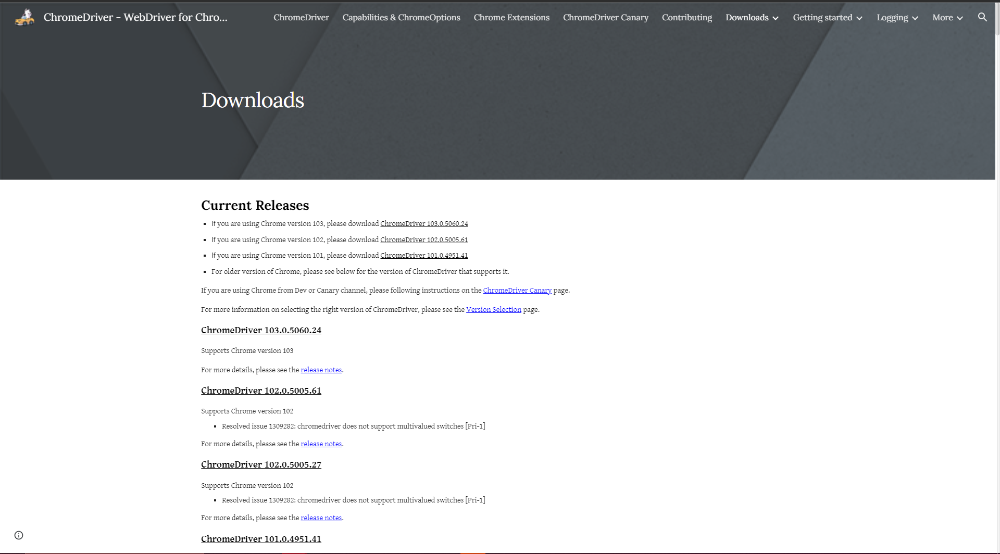

Hier wählt man dann den entsprechenden Download für die installierte Browserversion und in diesem Fall für Windows aus und lädt diesen herunter.

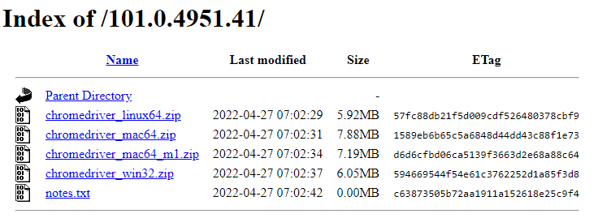

2. **Ordner erstellen um alle WebDriver zu sammeln.**  
Als nächstes muss ein Ordner erstellt werden, in dem der heruntergeladene Treiber entpackt wird.

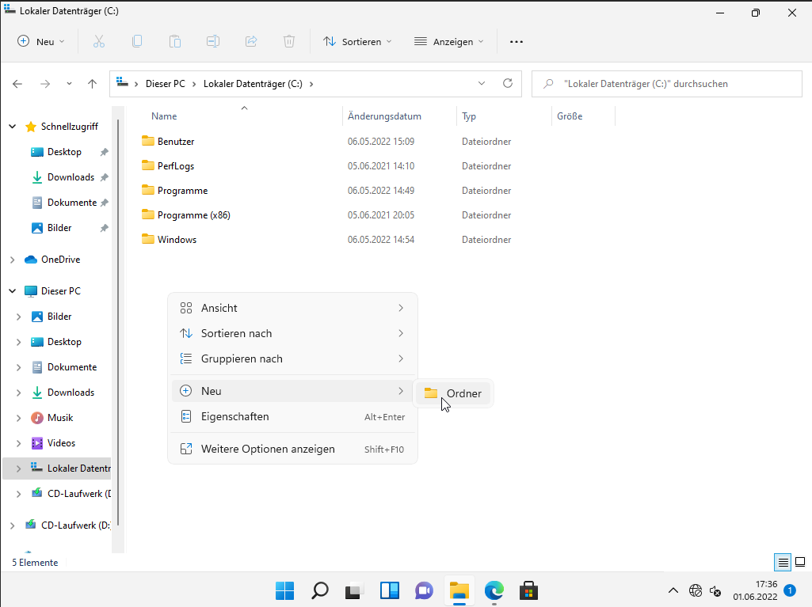

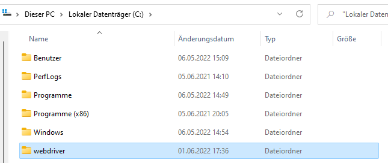

3. **Heruntergeladenen WebDriver in den Ordner entpacken.**  
In dem gerade erstellten Ordner kann dann die entsprechende Treiberdatei entpackt werden.

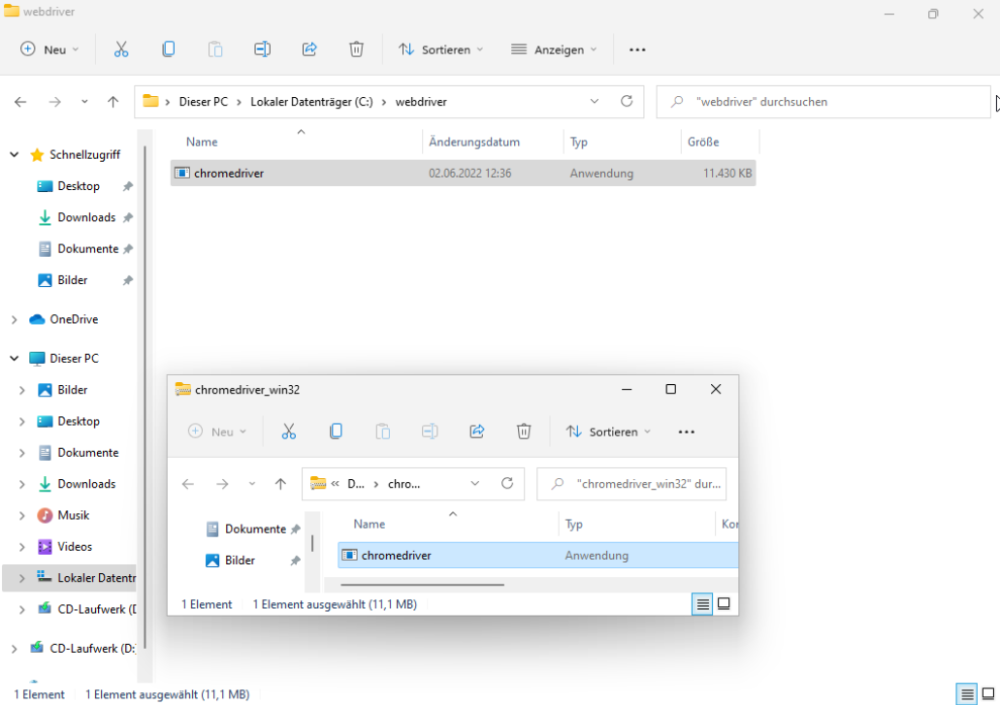

4. **Ordner dem PATH hinzufügen**  
Den Ordner zum PATH hinzufügen gestaltet sich unter Windows leider relativ umständlich.

Man beginnt mit einem Rechtsklick auf das Windows-logo in der Taskleiste.

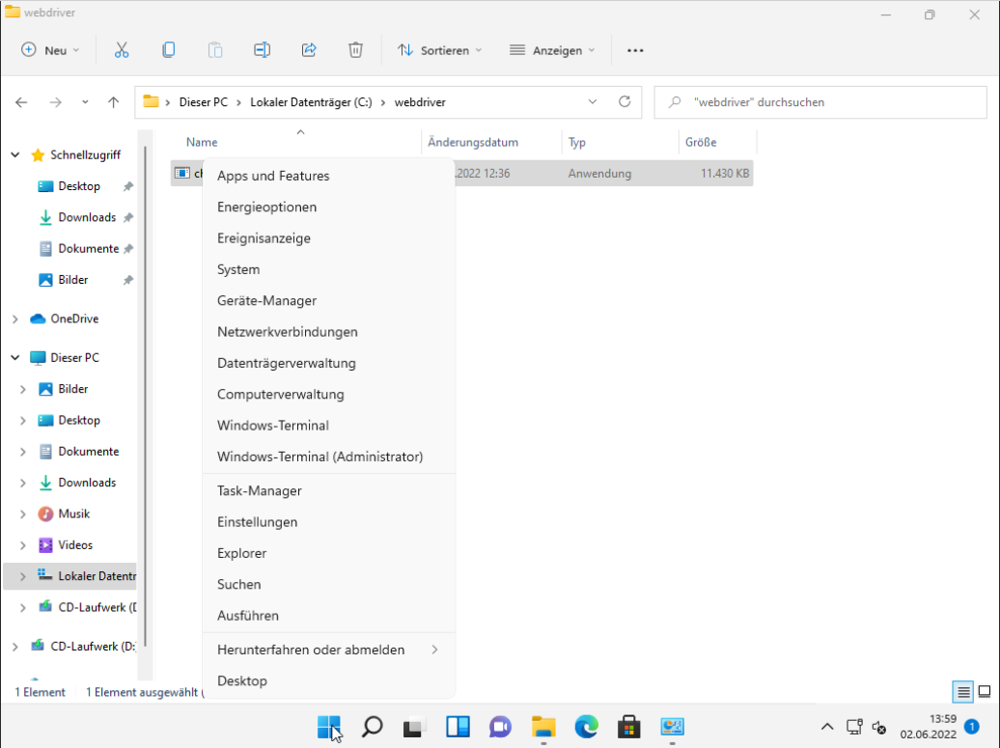{ height=30% }

Daraufhin klickt man auf *System* und öffnet dadurch die Systemeinstellungen.

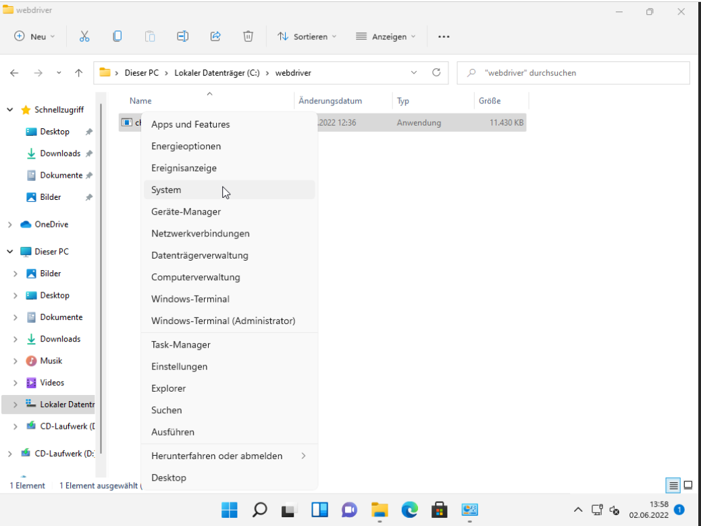{ height=30% }

Hier hat man die Option *Erweiterte Systemeinstellungen*.

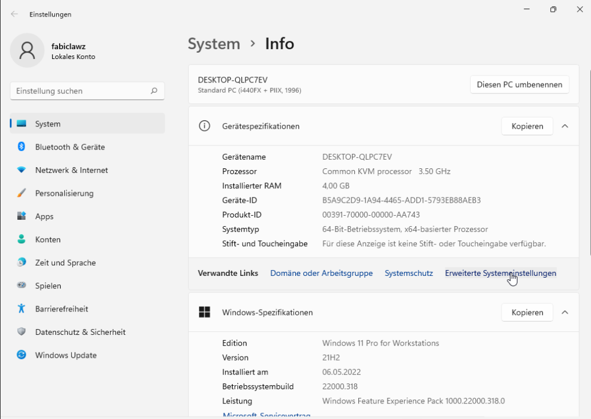{ height=40% }

Diese öffnet ein Fenster in dem sich unten der Knopf *Umgebungsvariablen* befindet.

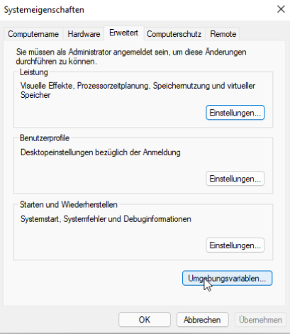{ height=40% }

Daraufhin öffnet sich das Menü für die Umgebungsvariablen und hier findet man auch PATH um diese Variable anzupassen.

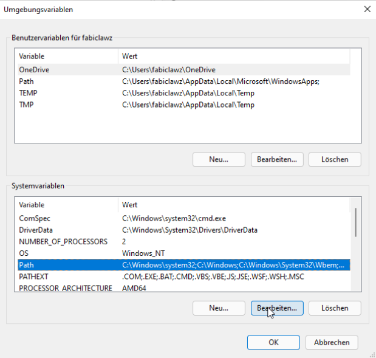{ height=40% }

Hier klickt man auf *Bearbeiten* woraufhin die Einträge der PATH Variable angezeigt werden. Hier wählt man *Neu* aus und gibt dort den Ordnerpfad an, in meinem Fall habe ich den Ordner unter `C:\webdriver`.

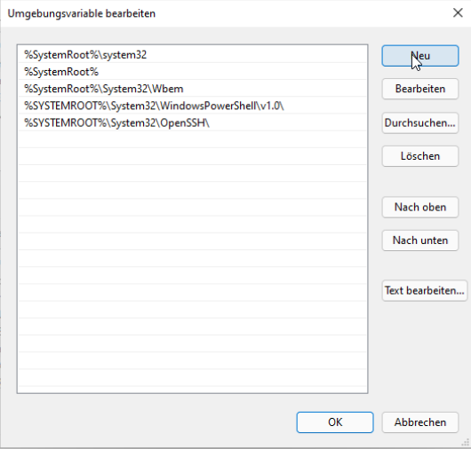{ height=40% }

### Linux

Unter Linux gibt es die Ordner `/usr/bin` oder `/usr/local/bin` die normalerweise im PATH vorhanden sind und vorgesehen sind selbstinstallierte Programme zu beinhalten.

1. **Passenden WebDriver herunterladen.**

Siehe Windows.

2. **WebDriver in `/usr/bin` oder `/usr/local/bin` entpacken.**

Die Installation der WebDriver unter Linux ist um einiges einfacher, hier muss man nur die entsprechende Datei herunterladen und in `/usr/bin` oder
`/usr/local/bin` entpacken.

Ein Weg ist z.B. ein paar simple Befehle in der Kommandozeile:

```bash
cp ~/Downloads/<webdriver package> /usr/bin
unzip /usr/bin/<webdriver package>
rm /usr/bin/<webdriver package>
```
\pagebreak
# Einführung in Selenium

## Das erste Browserfenster

Um erstmal einen sanften Einstieg zu bekommen fangen wir damit an ein Browserfenster zu öffnen.

Zu Beginn muss das WebDriver Paket aus Selenium importiert werden.

```python
from selenium import webdriver
```

Danach öffnet man den Browser und öffnet eine Seite wie folgt:

```python
browser = webdriver.Chrome()
browser.get("https://google.com")
```

Insgesamt kommt man dann also auf

```python
from selenium import webdriver

browser = webdriver.Chome()
browser.get("https://google.com")
```

um ein Browserfenster zu öffnen und Google aufzurufen.
Ausgeführt sieht das ungefähr so aus:

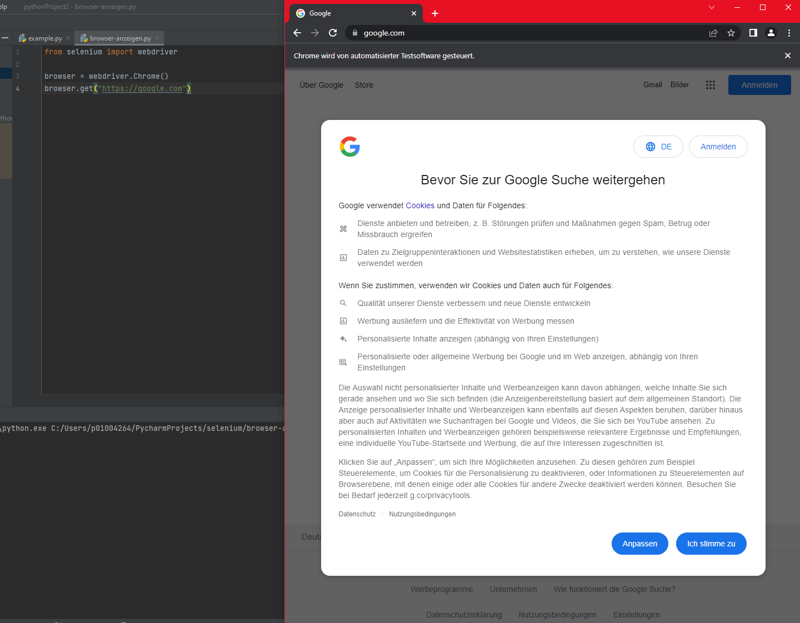{height=40%}

## Den Titel der Webseite abfragen
Der nächste logische Schritt ist nun natürlich Daten aus der Webseite bekommen.
Ein Anfang ist hier das auslesen des Titels der Webseite.

Hierfür kann man `browser.title` nutzen. Dies ist ein Attribut, welches den aktuellen Titel beinhalten.
Des Weiteren bietet sich nun auch an den Browser automatisch zu schließen mit `browser.quit()`.

Das Skript sollte dann am Ende wie folgt aussehen:

```python
from selenium import webdriver

browser = webdriver.Chrome()
browser.get("https://google.com")

print(browser.title)

browser.quit()
```

Wenn man dieses nun ausführt bekommt man wie erwartet `Google` als Ausgabe.

## Inhalt dynamischer Seiten abfragen
Viele Webseiten laden heute nicht mehr den Inhalt bevor sie eine Antwort an den Browser schicken. Häufig wird hier Javascript eingesetzt, was den eigentlichen
Inhalt von einem entfernten Backend abfragt. Dadurch lassen sich simplere Abfragemethoden wie direkte Requests oft nicht mehr durchführen. Google selbst ist ein
perfektes Beispiel dafür. Einerseits werden Abfragen ohne akzeptierten User-Agent zurückgewiesen und andererseits werden die Suchergebnisse erst im Browser
durch Javascript nachgeladen.
Hierfür bietet sich Selenium perfekt an, da die Abfragen in einem Browser ausgeführt werden und somit sowohl ein akzeptierter User-Agent vorhanden ist, sowie
auch Javascript beim Seitenaufruf ausgeführt wird.

Zuerst gilt es ein paar Hindernisse, die uns Google in den Weg stellt zu überwinden. Das erste Hinderniss, dass es zu bewältigen gilt, ist die Ladezeit der Seite. Nachdem man die Suchseite aufruft, fängt der Browser zwar schon an die ersten Elemente anzuzeigen, jedoch dauert es eine Sekunde bis alle Suchergebnisse angezeigt werden. Deshalb muss dem Browser mitgeteilt werden, dass er warten soll bis er auch tatsächlich die Elemente findet die wir suchen. Will man z.B. bis zu 10 Sekunden warten, macht man dies mit `browser.wait_implicitly(10)`.

Ein weiteres Hinderniss ist z.B. das Datenschutz pop-up, welches man angezeigt bekommt, wenn
man Google noch nie aufgerufen hat. Dieses wird unter Selenium immer angezeigt, da der gestartete Browser keine Cookies und andere Daten speichert oder vom
System abruft.

Dieses Pop-Up sieht wie folgt aus:

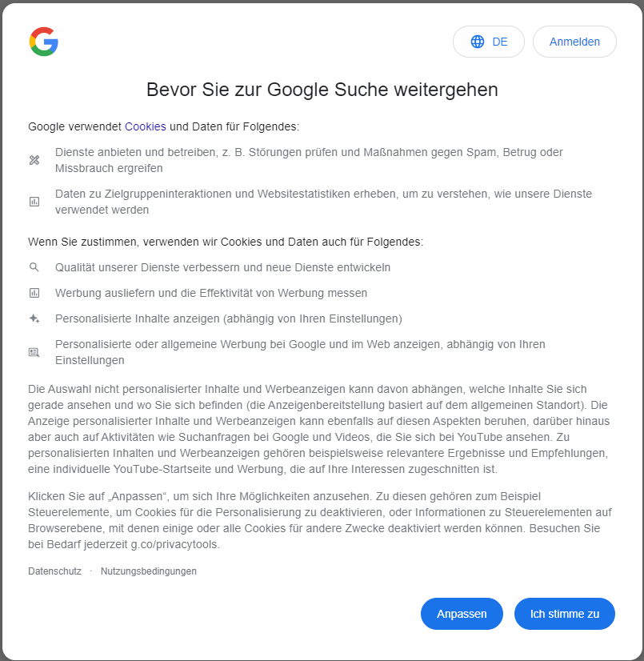{ height=50% }

Nun müssen wir also den *Ich stimme zu* Knopf finden und dann anklicken. Das geht mithilfe von XPath, welches eine Notation ist, die ein Objekt in einem
XML-basierten Dokument finden kann. Der benötigte XPath zum finden aller Elemente mit dem Text *Ich stimme zu* ist `//*[text()='Ich stimme zu']`. Nun kann man
den Knopf finden und drücken in dem man `browser.find_element_by_xpath("//*[text()='Ich stimme zu']").click()` ausführt.

Nun sehen wir schon Mal alles Suchergebnisse, müssen diese aber natürlich noch mit Selenium finden. Dies geschieht auch wieder über einen XPath. Diesmal muss
man aber ein wenig ausprobieren um einen passenden XPath zu finden, der auch alle Suchergebnisse zurückliefert. Dafür nimmt man am besten die Entwicklertools
des jeweiligen Browsers und macht einen Rechtsklick auf ein Suchergebnis und klickt *Untersuchen*.

Das Ergebnis sieht dann ungefähr so aus:

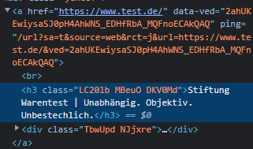

Wie man hier sieht ist der Text des Suchergebnisses in einem h3 HTML-Tag, welcher in einem a-Tag ist. Somit ergibt sich folgender XPath `//a/h3`. Nun kann man
alle Suchergebnisse abfragen in dem man `browser.find_elements_by_xpath('//a/h3')` ausführt. Der eigentliche Text ist jeweils in dem `.text` Attribut
eines Elements enthalten.

Ein fertiges Skript sieht dann ungefähr so aus

```python
from selenium import webdriver

browser = webdriver.Chrome()
browser.get("https://google.com/search?q=test")
browser.implicitly_wait(10)

browser.find_element_by_xpath("//*[text()='Ich stimme zu']").click()

results = browser.find_elements_by_xpath('//a/h3')

for result in results:
    print(result.text)

browser.quit()
```

und liefert für den Suchbegriff "Test" folgende Ergebnisse:

```
Stiftung Warentest | Unabhängig. Objektiv. Unbestechlich.
ÖKO-TEST: Richtig gut leben - Unabhängige Tests seit über ...
Test - Wikipedia
Testberichte.de Mit besten Empfehlungen zum passenden ...
Fragen und Antworten zu COVID-19 Tests
Testen | Zusammen gegen Corona
Tests - DER SPIEGEL
```
## Einholen von Daten über verschiedene Webseiten
Da man nicht immer nur Daten von einer einzigen Seite abfragen möchte, wollte ich als letztes Beispiel zeigen, wie man automatisiert verschiedene Seiten aufruft
und beispielsweise mithilfe von Javascript die Performancemetriken der Seiten abrufen kann.

Ich benutze hier eine CSV Datei mit 25 Webseiten, um diese automatisch einzulesen und durchzugehen.

Zuerst ist es eine gute Idee den Browser, sofern möglich in den Headless Modus zu schalten. Das heißt, dass der Browser kein Fenster anzeigt, sondern
vollständig im Hintergrund arbeitet.

Dies sieht dann wie folgt aus:

```python
options = webdriver.ChromeOptions()
options.headless = True

browser = webdriver.Chrome(options=options)
```

Daraufhin lese ich die CSV ein:

```python
import csv
...
with open('top-25-websites.csv', newline='') as websiteList:
	dialect = csv.Sniffer().sniff(websiteList.read(1024))
	websiteList.seek(0)
	reader = csv.reader(websiteList, dialect)
	for row in reader:
		...
```

Als weiteres Feature von Selenium nutze ich die Möglichkeit Javascript auszuführen. Man kann Javascript für verschiedene Dinge einsetzen aber hier setze ich
Javascript ein um die Ladezeiten der einzelnen Seiten zu ermitteln.

Im Code sieht das ganze dann so aus:

```python
navStart = browser.execute_script('return window.performance.timing.navigationStart')
resStart = browser.execute_script('return window.performance.timing.responseStart')
domComplete = browser.execute_script('return window.performance.timing.domComplete')
```

Daraus lässt sich dann einerseits die Antwortzeit des Backends berechnen in dem man die Differenz zwischen dem *responseStart* und dem *navigationStart*
betrachtet, andererseits kann man die Anzeigezeit des Frontends bestimmen in dem man die Differenz zwischen *domComplete* und *responseStart* berechnet.

Daraus ergibt sich folgendes Skript:

```python
import csv
import time
from selenium import webdriver

options = webdriver.ChromeOptions()
options.headless = True

results = []

with open('top-25-websites.csv', newline='') as websiteList:
 dialect = csv.Sniffer().sniff(websiteList.read(1024))
 websiteList.seek(0)
 reader = csv.reader(websiteList, dialect)
 for row in reader:
  browser = webdriver.Chrome(options=options)
  browser.get("https://" + row[1])
  navStart = browser.execute_script('return window.performance.timing.navigationStart')
  resStart = browser.execute_script('return window.performance.timing.responseStart')
  domComplete = browser.execute_script('return window.performance.timing.domComplete')
  backendTime = resStart-navStart
  frontendTime = domComplete-resStart
  totalTime = backendTime + frontendTime
  nameInDomain = row[1].split('.')[0]
  nameInTitle = nameInDomain.upper() in browser.title.upper()
  titlePercent = len(nameInDomain)*100 / len(browser.title) if nameInTitle else 0
  results.append((row[1], backendTime, frontendTime, totalTime, nameInTitle, titlePercent))
  browser.quit()

for row in results:
 print(row)
```

# Schlusswort

Selenium im Einsatz als Webscraper ist ein sehr interessantes Konzept, da Selenium als solches gar nicht für diesen nutzen vorgesehen ist, sondern als Framework
zum automatisierten Testen von Webseiten. Dennoch eignet es sich sehr gut für diese Aufgabe und kann sehr gute Ergebnisse liefern, vor allem auf Seiten die
nicht dafür vorgesehen sind von Computern eingelesen zu werden.

Alles an Code, sowie das Rohdokument, die Bilder und die PDF Datei kann sich in folgendem [Github
Repository](https://github.com/FFS2309/BI2-Whitepaper-Selenium) angeschaut werden.
